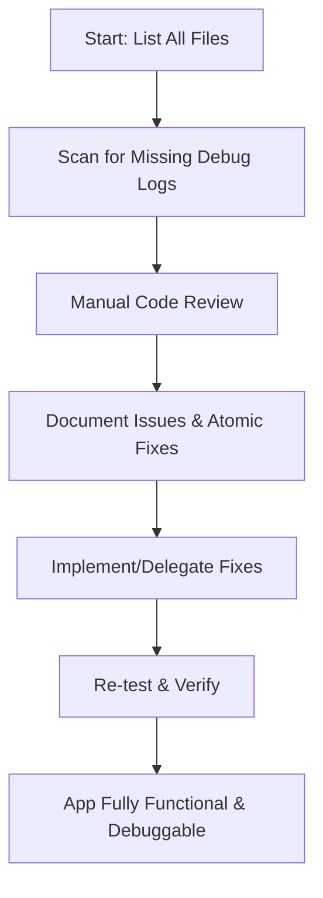

---

# PLAN: Complete Debug & Code Quality Overhaul

## 1. File Categorization

**UI/Frontend JS:**
- public_html/js/ui/*.js (modals, promptList, promptManager, sidebar, tagCategoryManager, dashboard, theme, toast, commentsResults, community, etc.)
- public_html/js/util/*.js (helpers, markdown)
- public_html/js/api/*.js (categories, tags, prompts, comments, results)
- public_html/js/state/*.js (appState)
- public_html/js/main.js

**Backend/API:**
- public_html/api/*.php (categories, tags, prompts, comments, results)
- public_html/db.php, db_parts/*.php, Logger.php

**CSS/Assets:**
- public_html/css/main.css, animate.css

**Data/Config:**
- public_html/*.json (prompts, comments, results, tags, categories)
- public_html/data/prompts-template.json

**Legacy:**
- public_html/legacy/* (all subfolders and files)

**Tests:**
- public_html/test/* (unit, integration, Playwright specs)

**Project Config:**
- .eslintrc.json, .prettierrc, .stylelintrc.json, package.json, phpstan.neon, phpcs.xml

---

## 2. Audit & Debug Plan Structure

### For Each File:
- **A. Debug Logging**
  - Ensure every function, event handler, and async operation has robust, standardized debug logs.
  - Add missing logs, especially for error cases, state changes, and user actions.

- **B. Code Quality & Best Practices**
  - Identify and fix code smells, anti-patterns, and outdated constructs.
  - Refactor large/monolithic functions for modularity and maintainability.
  - Move inline styles to CSS classes.
  - Ensure all async code has error boundaries and fallback UI.

- **C. UI/UX & Accessibility**
  - Check for ARIA attributes, keyboard navigation, focus management, and color contrast.
  - Ensure all controls, popups, and views are accessible and scalable.
  - Add ARIA-live regions and feedback where needed.

- **D. Feature Completeness**
  - Identify and implement missing features (comments/results popups, activity feed, toast queue, etc.).
  - Ensure all controls and views are fully functional and scalable for large data sets.

- **E. Atomic Fixes**
  - For each issue, propose a clear, atomic fix (e.g., "Add debug log to X", "Refactor Y for modularity", "Add ARIA-label to Z").
  - Group related fixes for efficient implementation.

---

## 3. Execution Plan

### Step 1: Automated & Manual Scan
- Use regex search to find all functions, event handlers, and async operations lacking debug logs.
- Manually review each file for code quality, UI/UX, accessibility, and feature completeness.

### Step 2: Document Findings
- For each file, list:
  - Missing debug logs (with line numbers)
  - Code smells and best practice violations
  - UI/UX and accessibility issues
  - Missing or broken features
  - Proposed atomic fixes

### Step 3: Implement/Delegate Fixes
- Prioritize atomic fixes by impact and complexity.
- Implement or delegate each fix, ensuring no area is skipped.
- Re-test all features and flows after fixes.

### Step 4: Final Verification
- Run all tests (unit, integration, Playwright).
- Manually verify UI/UX, accessibility, and debug logging coverage.
- Confirm all issues are resolved and the app is fully functional.

---

## 4. Example (per file)

```markdown
### public_html/js/ui/modals.js

- [ ] Add debug logs to all event handlers (lines X, Y, Z)
- [ ] Refactor renderCrudForm for modularity (split into sub-functions)
- [ ] Move inline styles to main.css
- [ ] Add ARIA-live to feedback areas
- [ ] Fix missing keyboard navigation for batch import modal
- [ ] Add error boundary to openModal/closeModal
...
```

---

## 5. Mermaid Diagram: Audit & Fix Workflow



---

## 6. Next Steps

- **User Review:** Please review this plan. Would you like any changes or additions?
- **Approval:** Once approved, this plan will be written to AUDIT.MD and implementation will proceed file by file, guaranteeing a complete, working, and debuggable app.

---
