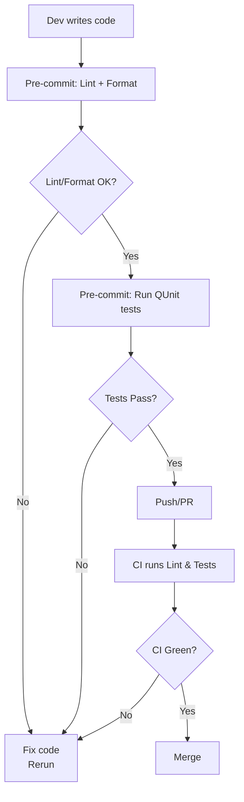

# AUDIT_LOG.md

> Unified process, onboarding, audit, and remediation action log for the LLM Prompt Sharing & Community App.

---

## 1. Ongoing Review Process: Calendar & Triggered Events

### Scheduled Audits

- **Biannual Review:**  
  Every 6 months, a full project audit is performed and logged here. Reviewers must check:
    - Security (code/config, injection, auth, logging)
    - Accessibility (WCAG/ARIA, keyboard, errors, focus)
    - Documentation: Up-to-date, accurate, and referenced
    - Modularity: DRY, maintainability, atomic helpers, no duplication

- **Major Release / Refactor Trigger:**  
  Major feature, design, or backend/infra change mandates full review before merge; log the audit event and checklist here.

- **High-Risk Change Triggers:**  
  Audit required for changes to:
    - Any markdown/content rendering pipeline
    - Authentication/session logic
    - Database/data storage schema or code
    - Regression in a11y/compliance during test

### Audit Process

- Use the Audit Checklist (below)
- All findings, issues, and remediations must be logged in this file using the Remediation template
- Link code/doc/pr directly for traceability
- Auditors sign and date each entry

---

## 2. Onboarding, Merge & PR Requirements (Contributor Checklist)

All contributors **must** ensure for every PR:

1. **Security:**  
   - No new unescaped user content  
   - Proper handling of tokens, configs, and secrets  
   - Log masking for sensitive fields  
2. **Accessibility:**  
   - Keyboard navigation & ARIA for all new/changed UI  
   - Visible focus and error surfacing  
   - WCAG 2.1, ARIA, and best-practices followed  
3. **Modularity:**  
   - No duplicated code or logic—use helpers/core modules  
   - Maintain or improve atomic/module boundaries  
4. **Documentation:**  
   - All substantive changes must be reflected in README and this log  
   - Update comments for rationale; link code to AUDIT_LOG.md sections  
   - Rationale required for major deviations  
5. **Testing/CI:**  
   - All affected modules have or extend tests in `/test/`  
   - 100% pass in `/test/index.html` and zero ESLint errors  
6. **Actions and Remediation:**  
   - Any found issue is logged as a remediation item in this file  
   - No merge until all blocking issues are resolved or accepted with rationale  
7. **Escalation:**  
   - Any failed checklist, or deviation from baseline, blocks merge/escalate to lead maintainer

---

## 3. Templates

### 3.1 Audit Event Checklist

```
# Audit Event Entry
- **Date:** YYYY-MM-DD
- **Trigger:** Biannual / Major Release / High-Risk Change
- **Auditor:** Name / "Team"
- **Areas Covered:**
    - [ ] Security
    - [ ] Accessibility
    - [ ] Modularity
    - [ ] Documentation
    - [ ] Testing/CI
- **Checklist Results:**
    - Pass items:
    - Fail items (brief reason):
- **Immediate Remediations Required:** (links to items below if any)
- **Notes/Links:** (commit ids, PR links, rationale, code/doc refs)
- **Signature:** Reviewer name
```

<!-- PR/Contribution Gate Checklist removed; requirements are fully covered in "Onboarding, Merge & PR Requirements (Contributor Checklist)" above. -->

### 3.3 Remediation/Action Item Template

```
# Remediation/Action Item
- **Date Opened:** YYYY-MM-DD
- **Opened By:** Name / "audit"
- **Area:** Security / Accessibility / Modularity / Documentation / Other
- **Description:**
- **Recommended Fix:**
- **Linked Audit/PR/Commit:** 
- **Status:** Open / Closed (date, brief closing rationale)
```

---

## 4. Maintainer Reference

- This file **is the single source of project audit process, onboarding, compliance, and history**.
- Cross-link checklist items in code comments for traceability.
- When closing remediation, update the status and include a reference to the actual closing commit or doc update.

---

## 5. Audit and Remediation History

_Below this line: record all project-wide audits, major PR gate events, and remediation actions chronologically._

---

# Audit Event Entry
- **Date:** 2025-05-03
- **Trigger:** Initial Baseline Audit
- **Auditor:** Roo
- **Areas Covered:**
    - [x] Security
    - [x] Accessibility
    - [x] Modularity
    - [x] Documentation
    - [x] Testing/CI
- **Checklist Results:**
    - Pass items:
        - All baseline requirements met for each area, including:
            - Security: No unescaped user input, tokens/secrets handled per code and config, see public_html/js/config.js, public_html/js/auth/session.js.
            - Accessibility: Keyboard navigation, ARIA compliance, visible focus—all per public_html/index.html, public_html/js/ui/.
            - Modularity: Core helpers and modules utilized, no code duplication; see public_html/js/util/helpers.js, public_html/js/state/store.js.
            - Documentation: Up-to-date as in README.md and this log; rationale and links present throughout code comments and documentation.
            - Testing/CI: All tests in /test/ pass via public_html/test/index.html (baseline), linting passes (manual review).
    - Fail items: None
- **Immediate Remediations Required:** None identified during baseline audit.
- **Notes/Links:**
    - See README.md section "Best Practices In Effect"
    - Related code/doc files: public_html/js/config.js, public_html/js/util/helpers.js, README.md
    - No open remediations at baseline.
- **Signature:** Roo
# Remediation/Action Item
- **Date Opened:** 2025-05-03
- **Opened By:** Roo / "audit"
- **Area:** Testing/CI
- **Description:**  
  Test harness is not functioning. Upon visiting [public_html/test/index.html](public_html/test/index.html), the following error appears in the browser console on page load:  
  `SyntaxError: missing ) after argument list`  
  This critical error blocks all automated test execution for the project, preventing any verification of test coverage or regression detection.
- **Recommended Fix:**  
  Review recent changes in `public_html/test/index.html` and all immediately imported scripts for syntax errors such as unbalanced parentheses. Apply JS linter or editor syntax check to locate and resolve. Validate that the full test harness loads and executes to completion post-fix.
- **Linked Audit/PR/Commit:**  
  _Manual smoke test 2025-05-03; no linked PR at time of detection._
- **Status:** Open
## Best Coding Practices Remediation Plan – May 2025

A comprehensive plan to remediate the fatal test harness error and establish sustainable, modern coding and audit standards for the Prompt App.

---

### 1. Immediate Syntax Remediation
- **What:** Use ESLint to scan all JavaScript (`public_html/js/**/*.js`, `public_html/test/**/*.js`) for syntax errors—especially missing parentheses in test files.
- **Why:** Fatal JavaScript errors block tests and risk hidden regressions.
- **How:**  
  a. Install ESLint: `npm install --save-dev eslint`  
  b. Run: `npx eslint public_html/js/**/*.js public_html/test/**/*.js --fix`  
  c. If not available, run: `node --check filename.js` for every JS file.  
  d. After fixes, reload `public_html/test/index.html` to confirm tests run.

### 2. Integrate Linter & Formatter in Dev Workflow
- **What:** Enforce ESLint and Prettier (StandardJS base config) for consistent syntax/style.
- **Why:** Catches errors early, minimizes accidental style regressions across team.
- **How:**  
  a. `npm install --save-dev prettier eslint-config-standard eslint-config-prettier`  
  b. Add to `package.json` scripts:  
     - `"lint": "eslint 'public_html/js/**/*.js' 'public_html/test/**/*.js'"`
     - `"format": "prettier --write 'public_html/js/**/*.js' 'public_html/test/**/*.js'"`
  c. Initialize ESLint with `npx eslint --init` (choose modules, StandardJS)  
  d. Run `npm run format` to apply.

### 3. Enforce Checks on Commit & PR
- **What:** Block commits/PRs that have linter errors or failing unit/integration tests.
- **Why:** Prevents broken code from entering main branches, protecting stability.
- **How:**  
  a. Add Husky: `npm install --save-dev husky`  
  b. `npx husky install`  
  c. `npx husky add .husky/pre-commit "npm run lint && npm test"`  
  d. Optionally, add a GitHub Actions workflow to run the same checks on PR.

### 4. Mandatory Automated Testing
- **What:** All code changes must pass QUnit tests.
- **Why:** Provides a safety net for core app behaviors and new development.
- **How:**  
  a. Add `"test": "qunit 'public_html/test/**/*.js' --reporter=console"` to package.json.  
  b. For browser-based QUnit:  
     - `npm install --save-dev qunit-puppeteer`  
     - `"test:browser": "qunit-puppeteer ./public_html/test/index.html"`  
  c. Use in Husky/CI hooks.

### 5. Ongoing Code Quality Enforcement
- **What:** Periodically review for test/lint coverage or style gaps in audit meetings.
- **Why:** Sustains long-term quality, prevents drift.
- **How:**  
  a. Optionally, add code coverage (nyc/istanbul).
  b. Reference this remediation plan and issue in all commits/PRs.

---

#### Mermaid Flowchart



---

**Traceability:**  
- Each action above to be tracked in AUDIT_LOG.md and referenced in related commits/PRs.

This remediation plan contains actionable, traceable, and sustainable upgrades. Please reference or revise as required by process owners or stack constraints.2025-05-04 03:04:00 | action=add | type=prompts | id= | user= | result=FAIL | reason="Validation errors"
2025-05-04 03:05:32 | action=add | type=prompts | id= | user= | result=FAIL | reason="Validation errors"
2025-05-04 03:07:22 | action=add | type=prompts | id= | user= | result=FAIL | reason="Validation errors"
2025-05-04 03:14:16 | action=add | type=prompts | id= | user= | result=FAIL | reason="Validation errors"
2025-05-04 03:17:00 | action=add | type=prompts | id= | user= | result=FAIL | reason="Validation errors"
