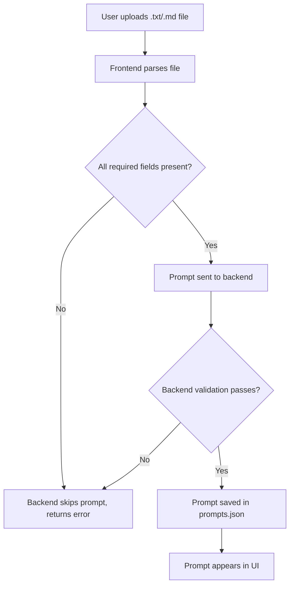

# Investigation: Why .txt/.md Uploads Are Not Seen in Prompt Card

## Summary

When uploading a `.txt` or `.md` file, the import appears to succeed, but the prompt is not visible in the UI. The root cause is that the backend does not persist the prompt due to strict schema validation. If any required field is missing or of the wrong type, the prompt is silently skipped and not saved. As a result, `prompts.json` remains empty and nothing appears in the prompt card.

---

## Key Findings

- **Frontend** constructs a prompt object from `.txt`/`.md` files, but if any required field (e.g., `description`, `tags`, `user_id`, `author`, etc.) is missing or invalid, the backend skips the prompt.
- **Backend** only saves prompts that match the canonical schema in `data/prompts-template.json`.
- **No clear error** is shown in the UI if the backend skips the prompt; the import appears to succeed.
- **`prompts.json` remains empty** after import, confirming that nothing was saved.

---

## Canonical Schema (from `data/prompts-template.json`)

```json
{
  "schemaVersion": "1.0",
  "id": "test-prompt-1",
  "title": "Summarize the following text",
  "description": "...",
  "prompt": "...",
  "tags": ["summary", "nlp"],
  "user_id": "localuser",
  "author": "audit-debug",
  "created_at": "...",
  "updated_at": "..."
}
```
**All these fields must be present and of the correct type.**

---

## Flow Diagram



---

## Plan to Diagnose and Fix

1. **Add Logging and Error Display**
   - Ensure the batch import modal clearly displays all backend errors returned from the import API, not just a success/failure message.

2. **Validate Prompt Object Construction**
   - Update the frontend logic for `.txt`/`.md` imports to ensure all required fields are present and of the correct type, matching the canonical schema.

3. **Test with a Valid Prompt**
   - Manually construct a `.txt`/`.md` import with all required fields and verify it appears in `prompts.json` and the UI.

4. **(Optional) Relax Backend Validation**
   - Consider making the backend more forgiving, e.g., auto-filling missing optional fields or providing clearer error messages.

---

## Next Steps

- Update the frontend to ensure all required fields are present for `.txt`/`.md` imports.
- Improve error reporting in the batch import modal.
- Test the import and confirm prompts appear in `prompts.json` and the UI.